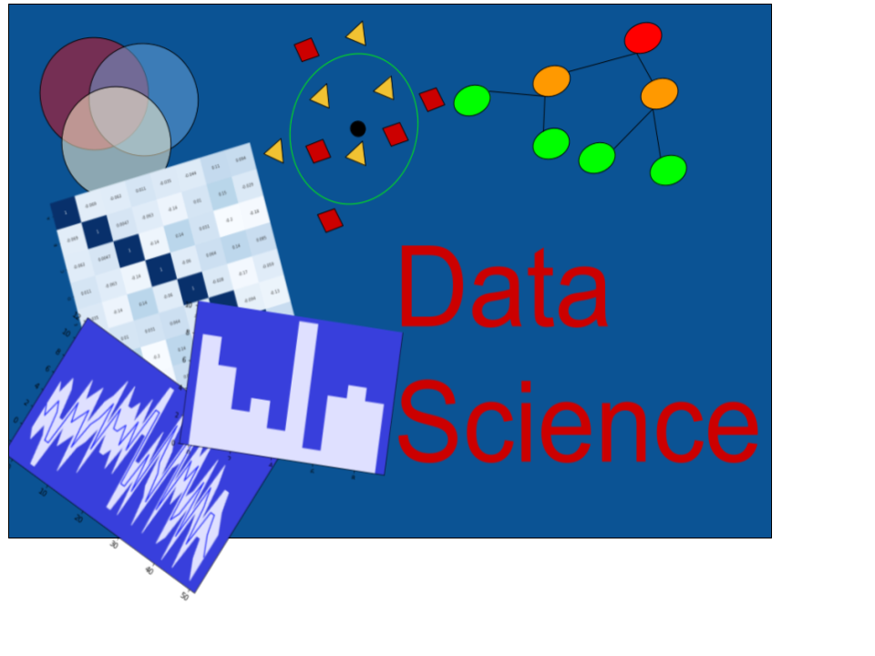

# About Me

I am Morgan Keith, I use data science to predict classifications for data with machine learning techniques. As a former gymnast and coach I worked in a team and taught others based on their strengths. I worked in inventory which required creatively finding and solving errors in the process. I use these skills to work in a team to creatively solve problems while building machine learning models.

### Projects

##### Airline Delays

Used Decision Tree, Random Forest, and XGBoost to predict a flight’s delay.
- Decision Tree used the feature's trend with a flight delay 
- Random Forest aggregates all the features of a flight’s delay trend 
- Used XGBoost for gradient descent ability to minimize loss and predict delays  
- RandomSearchCV to tune parameters and improve prediction results

##### Housing Price Prediction

Used SARIMA modeling to predict future house pricing within the confidence interval.
- Set index to time series and used pandas melt to transform the dataframe from wide to long
- SARIMA model uses autorregressive (p), moving average(q), differencing to series (d), to weight more recent events higher
- Visualize predicted housing prices 3 years in advance with the confidence interval to represent uncertainty

##### Predicting Delivery Status

Used Logistic Regression, Random Forest, and XGBoost to predict order status
- Logistic Regression to observe how a baseline model predicted.
- Random Forest to aggregate various model classification outcomes
- XGBoost, its bagging helped improve the model, since the data has unequal samples sizes, the larger samples provied less noise. 
